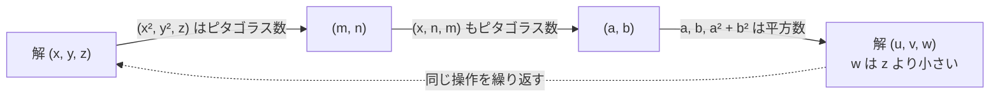
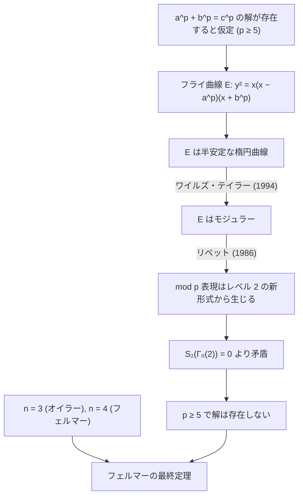
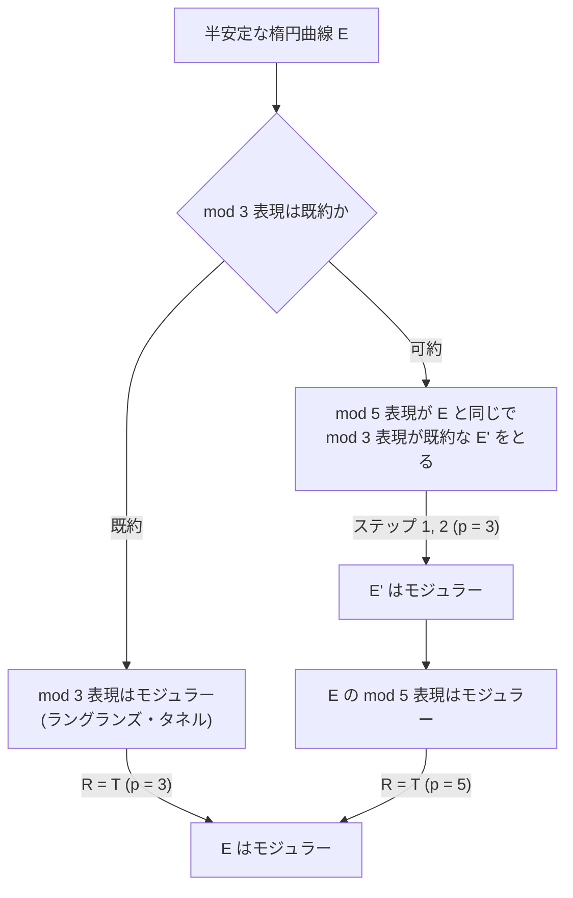

## 前提知識

- <Link href="/posts/group-theory">群論</Link>
- <Link href="/posts/complex-function-theory">複素関数論</Link>

## 定理の主張

<Hint level="info">
**フェルマーの最終定理**

$n\ge 3$ を整数とする。このとき

$$
x^n+y^n=z^n
$$

を満たす正の整数の組 $(x,y,z)$ は存在しない。

</Hint>

$n=2$ のときは $3^2+4^2=5^2$ のように無数の解 (ピタゴラス数) が存在するので、指数が 1 つ上がっただけで解が消えるという主張である。
主張は中学生でも理解できるが、1995 年にアンドリュー・ワイルズが証明を完成させるまで約 360 年間未解決だった。

## 歴史

| 年      | 出来事                                                                                                     |
| :------ | :--------------------------------------------------------------------------------------------------------- |
| 1637 頃 | フェルマーがディオファントス『算術』の余白に「真に驚くべき証明を見つけたが、余白が狭すぎて書けない」と記す |
| 1670    | フェルマーの息子が書き込み付きの『算術』を出版し、問題が世に知られる                                       |
| 17 世紀 | フェルマー自身による $n=4$ の証明 (無限降下法)                                                             |
| 1770    | オイラーが $n=3$ を証明 (一部不備あり)                                                                     |
| 1825    | ディリクレとルジャンドルが $n=5$ を証明                                                                    |
| 1839    | ラメが $n=7$ を証明                                                                                        |
| 1847    | ラメが一般の場合の「証明」を発表するが、素因数分解の一意性を誤って仮定していた                             |
| 1847    | クンマーが正則素数に対して定理を証明                                                                       |
| 1955    | 谷山豊が楕円曲線とモジュラー形式に関する問題を提起 (後の谷山・志村予想)                                    |
| 1984    | フライが「フェルマーの最終定理の反例から作った楕円曲線はモジュラーでない」と予想                           |
| 1986    | リベットがセールのε予想の該当部分を証明し、谷山・志村予想 ⇒ フェルマーの最終定理 が確定                    |
| 1993    | ワイルズが証明を発表するが、後に欠陥が見つかる                                                             |
| 1994    | ワイルズがテイラーとの共同研究で欠陥を修正                                                                 |
| 1995    | Annals of Mathematics に論文が掲載される                                                                   |

フェルマーが本当に一般の $n$ について証明を持っていた可能性は低いと考えられている。
後年の手紙で $n=3,4$ の場合にしか言及していないためである。

## 素数の指数への帰着

$n\ge 3$ は必ず 4 か奇素数 $p$ のどちらかで割り切れる。
$n=km$ のとき、$x^n+y^n=z^n$ の解 $(x,y,z)$ があれば

$$
(x^k)^m+(y^k)^m=(z^k)^m
$$

より $(x^k,y^k,z^k)$ は指数 $m$ の解になる。
したがって、**$n=4$ と $n=p$ (奇素数) の場合を示せば十分**である。

また、解 $(x,y,z)$ が公約数 $d$ を持てば $(x/d,y/d,z/d)$ も解なので、$\gcd(x,y,z)=1$ (このとき $x,y,z$ は対ごとに互いに素) と仮定してよい。

## n = 2 の場合: ピタゴラス数

$n=4$ の証明に使うので、先にピタゴラス数の一般形を求めておく。

<Hint level="info">
**原始ピタゴラス数の一般形**

$\gcd(x,y)=1$, $y$ が偶数である $x^2+y^2=z^2$ の正の整数解は、$m\gt n\gt 0$, $\gcd(m,n)=1$, $m\not\equiv n\pmod 2$ を満たす整数 $m,n$ を用いて

$$
x=m^2-n^2,\quad y=2mn,\quad z=m^2+n^2
$$

と一意に表せる。

</Hint>

  $x,y$ が共に奇数だと $x^2+y^2\equiv 2\pmod 4$ となり平方数にならないので、一方は偶数である。$y$ を偶数とすると $x,z$ は奇数で

$$
\left(\frac{y}{2}\right)^2=\frac{z+x}{2}\cdot\frac{z-x}{2}
$$

$\frac{z+x}{2}$ と $\frac{z-x}{2}$ の公約数は、その和 $z$ と差 $x$ を割り切るので 1 である。
互いに素な 2 つの正の整数の積が平方数なので、それぞれが平方数であり

$$
\frac{z+x}{2}=m^2,\quad\frac{z-x}{2}=n^2
$$

とおける。これを解けば $x=m^2-n^2$, $z=m^2+n^2$, $y=2mn$ を得る。
$z$ が奇数なので $m,n$ の偶奇は異なる。

## n = 4 の場合: 無限降下法

フェルマーの最終定理の $n=4$ の場合より強い、次の命題を示す。

<Hint level="info">
**定理**

$x^4+y^4=z^2$ を満たす正の整数の組 $(x,y,z)$ は存在しない。

</Hint>

$z^4=(z^2)^2$ なので、これが示されれば $x^4+y^4=z^4$ に解がないことも従う。

  解が存在すると仮定し、その中で $z$ が最小のものをとる。
  最小性より $\gcd(x,y)=1$ である。

$(x^2)^2+(y^2)^2=z^2$ なので $(x^2,y^2,z)$ は原始ピタゴラス数であり、$y$ を偶数としてよい。
ピタゴラス数の一般形より

$$
x^2=m^2-n^2,\quad y^2=2mn,\quad z=m^2+n^2
$$

($\gcd(m,n)=1$, $m,n$ の偶奇は異なる) と書ける。

$x^2+n^2=m^2$ で $x$ は奇数である。もし $m$ が偶数で $n$ が奇数なら左辺 $\equiv 2\pmod 4$, 右辺 $\equiv 0\pmod 4$ となり矛盾するので、$m$ は奇数, $n$ は偶数である。
よって $(x,n,m)$ も原始ピタゴラス数であり

$$
x=a^2-b^2,\quad n=2ab,\quad m=a^2+b^2
$$

($\gcd(a,b)=1$) と書ける。これを $y^2=2mn$ に代入すると

$$
\left(\frac{y}{2}\right)^2=ab(a^2+b^2)
$$

$a,b,a^2+b^2$ は対ごとに互いに素なので、それぞれが平方数である。

$$
a=u^2,\quad b=v^2,\quad a^2+b^2=w^2
$$

とおくと $u^4+v^4=w^2$ となり、$(u,v,w)$ も解である。ところが

$$
w\le w^2=a^2+b^2=m\lt m^2+n^2=z
$$

なので、$z$ の最小性に矛盾する。

このように「解があればより小さい解が作れる」ことを示して矛盾を導く手法を**無限降下法**という。
正の整数の無限降下列は存在しないことが根拠である。

上の証明で作った数の流れを図にすると次のようになる。

## クンマーと円分体

### 円分体上での因数分解

$p$ を奇素数、$\zeta=e^{2\pi i/p}$ を 1 の原始 $p$ 乗根とすると、$x^p+y^p$ は $\mathbb{Z}[\zeta]$ 上で

$$
x^p+y^p=\prod_{k=0}^{p-1}(x+\zeta^k y)
$$

と 1 次式の積に分解できる。
したがって $x^p+y^p=z^p$ は「$p$ 個の数の積が $p$ 乗数になる」という形に書き直せる。

$\mathbb{Z}$ であれば「互いに素な数の積が $p$ 乗数ならば、それぞれが $p$ 乗数」と議論を進められる (上の $n=4$ の証明でも使った論法)。
ラメはこれを $\mathbb{Z}[\zeta]$ でもそのまま使ったが、この論法は**素因数分解の一意性**に依存している。

### 一意分解の破綻

$\mathbb{Z}[\zeta]$ のような整数環の拡張では、素因数分解が一意とは限らない。
簡単な例として $\mathbb{Z}[\sqrt{-5}]$ では

$$
6=2\cdot 3=(1+\sqrt{-5})(1-\sqrt{-5})
$$

と 2 通りに分解でき、$2,3,1\pm\sqrt{-5}$ はいずれもこれ以上分解できない (既約元)。

$\mathbb{Z}[\zeta_p]$ で一意分解が成り立つのは $p\le 19$ の場合に限られ、$p=23$ で初めて破綻する。

### イデアルと類数

クンマーは数の代わりに「理想数」(現代の言葉では**イデアル**) を考えることで一意分解を回復させた。
整数環のイデアルは素イデアルの積に一意に分解できる。

一意分解からどれだけ離れているかは**イデアル類群**の位数 = **類数** $h$ で測られ、$h=1$ であることと一意分解が成り立つことは同値である。

### 正則素数

<Hint level="info">
**クンマーの定理 (1847)**

奇素数 $p$ が $\mathbb{Q}(\zeta_p)$ の類数を割り切らないとき (このような $p$ を**正則素数**という)、$x^p+y^p=z^p$ は正の整数解を持たない。

</Hint>

正則素数かどうかはベルヌーイ数で判定できる。
$p$ が正則であることは、$p$ がベルヌーイ数 $B_2,B_4,\dots,B_{p-3}$ の分子をいずれも割り切らないことと同値である (クンマーの判定法)。

100 未満の非正則素数は $37,59,67$ の 3 つだけである。例えば $B_{32}$ の分子は $37$ で割り切れる。
非正則素数は無限に存在することが知られており、この方向で全ての $p$ を扱うことはできなかった。

## 楕円曲線

ここから現代的な証明の話になる。主役は**楕円曲線**と**モジュラー形式**である。

### 定義

有理数体 $\mathbb{Q}$ 上の**楕円曲線**とは、$a,b\in\mathbb{Q}$ を用いて

$$
E: y^2=x^3+ax+b
$$

と表される曲線で、**判別式**

$$
\Delta=-16(4a^3+27b^2)
$$

が $0$ でないもの (つまり右辺の 3 次式が重根を持たない、特異点がないもの) をいう。

名前に反して楕円ではない。楕円の弧長を求める積分 (楕円積分) の研究から生まれたためにこう呼ばれる。

### 群構造

楕円曲線上の点 (無限遠点 $O$ を含む) は、次の規則で**アーベル群**をなす。

- 単位元は無限遠点 $O$
- 2 点 $P,Q$ を通る直線と $E$ の 3 つ目の交点を $R$ とするとき、$R$ を $x$ 軸に関して折り返した点を $P+Q$ とする
- $P=Q$ のときは $P$ における接線を使う

これを**弦接線法**という。
係数が有理数なので、有理点同士の和はまた有理点になり、有理点全体 $E(\mathbb{Q})$ は部分群をなす。

<Hint level="info">
**モーデルの定理**

$E(\mathbb{Q})$ は有限生成アーベル群である。すなわち、有限群 $T$ と非負整数 $r$ を用いて

$$
E(\mathbb{Q})\cong T\oplus\mathbb{Z}^r
$$

と表せる。$r$ を $E$ の**階数 (ランク)** という。

</Hint>

### 素数 p を法とする還元

楕円曲線の係数を整数にとり、素数 $p$ を法として考えると、有限体 $\mathbb{F}_p$ 上の曲線が得られる。
$\mathbb{F}_p$ 上の点の個数 (無限遠点を含む) を $\#E(\mathbb{F}_p)$ として

$$
a_p(E)=p+1-\#E(\mathbb{F}_p)
$$

と定める。ハッセの定理より $|a_p(E)|\le 2\sqrt{p}$ である。

$p$ が判別式を割り切るとき、還元した曲線は特異点を持つ (**悪い還元**)。
特異点には次の 2 種類がある。

- **結節点** ((b) の原点): 異なる 2 本の接線を持つ特異点
- **尖点** ((c) の原点): 接線が 1 本に重なった特異点

特異点が結節点である場合を**乗法的還元**、尖点である場合を**加法的還元**という。
全ての悪い還元が乗法的である楕円曲線を**半安定**という。

また、悪い還元を持つ素数から定まる整数 $N$ を $E$ の**導手**という。半安定な楕円曲線の導手は、悪い還元を持つ素数の積 (平方因子を持たない整数) になる。

## モジュラー形式

複素上半平面を $\mathbb{H}=\{\tau\in\mathbb{C}\mid\operatorname{Im}\tau\gt 0\}$ とし、正の整数 $N$ に対して

$$
\Gamma_0(N)=\left\{\begin{pmatrix}a&b\\c&d\end{pmatrix}\in SL_2(\mathbb{Z})\;\middle|\;c\equiv 0\pmod N\right\}
$$

とおく。$\mathbb{H}$ 上の正則関数 $f$ が、任意の $\begin{pmatrix}a&b\\c&d\end{pmatrix}\in\Gamma_0(N)$ に対して

$$
f\left(\frac{a\tau+b}{c\tau+d}\right)=(c\tau+d)^2f(\tau)
$$

を満たし、さらに尖点 (cusp) で $0$ になるなどの条件を満たすとき、$f$ を**重さ 2, レベル $N$ の尖点形式**という。

$\begin{pmatrix}1&1\\0&1\end{pmatrix}\in\Gamma_0(N)$ より $f(\tau+1)=f(\tau)$ なので、$f$ は $q=e^{2\pi i\tau}$ についてフーリエ展開できる。

$$
f(\tau)=\sum_{n=1}^{\infty}a_n(f)q^n
$$

重さ 2, レベル $N$ の尖点形式全体は有限次元の複素ベクトル空間 $S_2(\Gamma_0(N))$ をなす。
特にヘッケ作用素の同時固有関数で正規化されたもの ($a_1=1$) を**新形式**という。

### 基本領域とモジュラー曲線

$SL_2(\mathbb{Z})$ は 1 次分数変換 $\tau\mapsto\frac{a\tau+b}{c\tau+d}$ によって $\mathbb{H}$ に作用し、平行移動 $T:\tau\mapsto\tau+1$ と反転 $S:\tau\mapsto-1/\tau$ で生成される。
$\mathbb{H}$ の各点は、この作用で次の**基本領域**

$$
\mathcal{F}=\left\{\tau\in\mathbb{H}\;\middle|\;|\operatorname{Re}\tau|\le\frac{1}{2},\ |\tau|\ge 1\right\}
$$

のどこかに移る。$\mathcal{F}$ の像 ($T^n\mathcal{F}$ や $S\mathcal{F}$ など) は $\mathbb{H}$ を隙間なく敷き詰める。

$\mathcal{F}$ の左右の辺を $T$ で、下の円弧の左右を $S$ で貼り合わせ、上端の $i\infty$ (尖点) に 1 点を付け加えるとリーマン球面になる。
同様に $\Gamma_0(N)$ の基本領域を貼り合わせて尖点を付け加えたコンパクトなリーマン面を**モジュラー曲線** $X_0(N)$ という。
$\Gamma_0(N)$ は $SL_2(\mathbb{Z})$ の指数有限の部分群なので、その基本領域は $\mathcal{F}$ の像を有限個 (指数の個数だけ) 並べたものになる。

楕円曲線の特異点の「尖点」とモジュラー曲線の「尖点 (cusp)」は名前が同じだが、別の概念である。

<Hint level="warn">
**$S_2(\Gamma_0(2))=0$**

レベル 2 の重さ 2 の尖点形式は $0$ しか存在しない。$S_2(\Gamma_0(N))$ の次元はモジュラー曲線 $X_0(N)$ の種数に等しく、$X_0(2)$ の種数は $0$ だからである。
この事実が証明の最後の決め手になる。

</Hint>

## 谷山・志村予想

<Hint level="info">
**谷山・志村予想 (モジュラリティ定理)**

$\mathbb{Q}$ 上の任意の楕円曲線 $E$ はモジュラーである。
すなわち、$E$ の導手を $N$ とするとき、重さ 2, レベル $N$ の新形式 $f$ が存在して、$N$ を割り切らない全ての素数 $p$ について

$$
a_p(E)=a_p(f)
$$

が成り立つ。

</Hint>

楕円曲線という代数的・数論的な対象 ($\mathbb{F}_p$ 上の点の個数) と、モジュラー形式という解析的な対象 (フーリエ係数) が、全ての素数にわたって一致するという驚くべき主張である。

ワイルズが証明したのは**半安定な楕円曲線**の場合で、フェルマーの最終定理にはこれで十分である。
完全な形の証明は 2001 年にブルイユ, コンラッド, ダイアモンド, テイラーによって完成した。

## フライ曲線とリベットの定理

### フライ曲線

$p\ge 5$ を素数とし、$a^p+b^p=c^p$ を満たす互いに素な正の整数 $a,b,c$ が存在したと仮定する。
このとき、次の楕円曲線を考える。

$$
E_{a,b}: y^2=x(x-a^p)(x+b^p)
$$

これを**フライ曲線**という。右辺の 3 次式の根は $0,a^p,-b^p$ で、その差の積から判別式が計算できる。

$$
\Delta=16(a^p)^2(b^p)^2(a^p+b^p)^2=16(abc)^{2p}
$$

判別式が $2p$ 乗数という極端な形をしており、$a,b$ の偶奇を適切に正規化すると、フライ曲線は**半安定**で導手が

$$
N=\prod_{\ell\mid abc}\ell
$$

($abc$ を割り切る素数の積) になることが分かる。

フライは、このような「異常な」楕円曲線はモジュラーではありえないと予想した。

### リベットの定理

楕円曲線 $E$ の $p$ 等分点 (群として $pP=O$ となる点) 全体には絶対ガロア群 $\operatorname{Gal}(\overline{\mathbb{Q}}/\mathbb{Q})$ が作用し、2 次元表現

$$
\bar{\rho}_{E,p}:\operatorname{Gal}(\overline{\mathbb{Q}}/\mathbb{Q})\to GL_2(\mathbb{F}_p)
$$

が得られる。これを **mod $p$ ガロア表現**という。

フライ曲線の場合、判別式が $2p$ 乗数であるため、奇素数 $\ell\mid abc$ における悪い還元が $\bar{\rho}_{E,p}$ にはほとんど現れない。
セールはこの観察から、表現が由来するモジュラー形式のレベルを下げられるという予想 (ε予想) を立てた。

<Hint level="info">
**リベットの定理 (レベル下げ, 1986)**

フライ曲線 $E_{a,b}$ がモジュラーであれば、$\bar{\rho}_{E,p}$ は重さ 2, **レベル 2** の新形式から生じる。

</Hint>

ところが $S_2(\Gamma_0(2))=0$ なので、レベル 2 の新形式は存在しない。したがって

<Hint level="info">
**系**

フライ曲線はモジュラーではない。すなわち、谷山・志村予想 (の半安定な場合) が正しければ、フェルマーの最終定理も正しい。

</Hint>

## 証明の全体像

## ワイルズの証明の概略

ワイルズが示したのは「半安定な楕円曲線はモジュラーである」という定理である。
証明の骨格は次のようになっている。

1. **出発点 (ラングランズ・タネルの定理)**

   $\bar{\rho}_{E,3}$ が既約であれば、それはモジュラーである。
   これは $GL_2(\mathbb{F}_3)$ が可解群であることを用いた、ラングランズとタネルの結果である。

2. **持ち上げ (R = T 定理)**

   mod $p$ 表現 $\bar{\rho}$ がモジュラーであれば、その「持ち上げ」となる $p$ 進表現 $\rho_{E,p}:\operatorname{Gal}(\overline{\mathbb{Q}}/\mathbb{Q})\to GL_2(\mathbb{Z}_p)$ もモジュラーであることを示す。
   具体的には、$\bar{\rho}$ の変形 (deformation) 全体をパラメトライズする**普遍変形環 $R$** と、モジュラー形式から作られる**ヘッケ環 $\mathbb{T}$** の間の自然な全射 $R\to\mathbb{T}$ が同型であることを示す。

   $R$ はガロア表現 (楕円曲線の側)、$\mathbb{T}$ はモジュラー形式の側を表すので、$R\cong\mathbb{T}$ は「全ての変形がモジュラー」であることを意味する。

3. **3-5 トリック**

   $\bar{\rho}_{E,3}$ が既約でない場合は 1 が使えない。
   このときは $\bar{\rho}_{E,5}$ を考え、$\bar{\rho}_{E',5}\cong\bar{\rho}_{E,5}$ かつ $\bar{\rho}_{E',3}$ が既約となる別の半安定楕円曲線 $E'$ を見つける。
   $E'$ はステップ 1, 2 によりモジュラーなので $\bar{\rho}_{E,5}$ もモジュラーとなり、再びステップ 2 を $p=5$ で適用して $E$ がモジュラーであることが従う。

<Hint level="warn">
**1993 年の欠陥**

1993 年 6 月にケンブリッジのニュートン研究所で発表された当初の証明では、ステップ 2 でコリヴァギン・フラッハの方法 (オイラー系) を拡張する部分に欠陥があった。
1994 年 9 月、ワイルズはかつて放棄した岩澤理論的なアプローチと組み合わせ、テイラーとの共同研究によってヘッケ環が完全交叉であることを示し、欠陥を回避した。

</Hint>

## 参考文献

- Andrew Wiles, "Modular elliptic curves and Fermat's Last Theorem", _Annals of Mathematics_ 141 (1995), 443–551.
- Richard Taylor, Andrew Wiles, "Ring-theoretic properties of certain Hecke algebras", _Annals of Mathematics_ 141 (1995), 553–572.
- Kenneth A. Ribet, "On modular representations of Gal($\overline{\mathbb{Q}}/\mathbb{Q}$) arising from modular forms", _Inventiones Mathematicae_ 100 (1990), 431–476.
- サイモン・シン『フェルマーの最終定理』(青木薫 訳, 新潮文庫)
