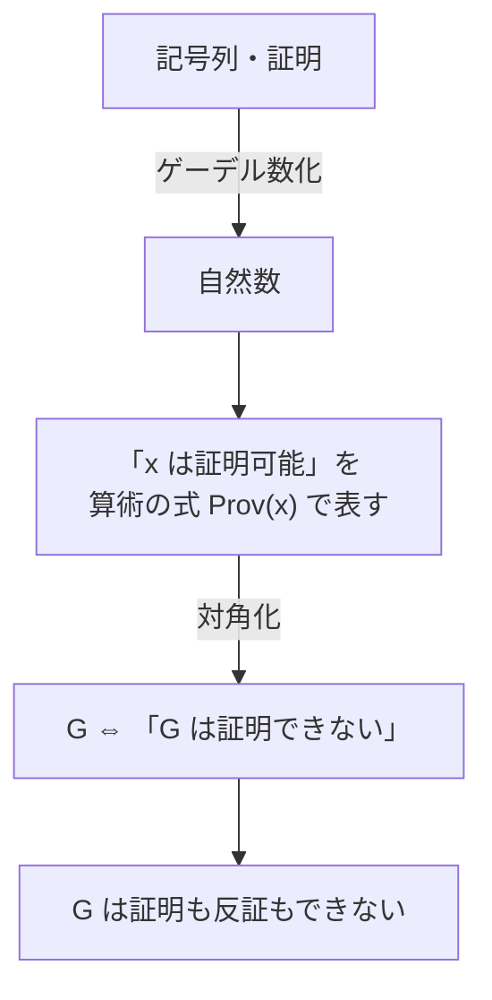

**ゲーデルの不完全性定理 (Gödel's incompleteness theorems)** は、1931年にクルト・ゲーデルが証明した数理論理学の定理である。
大雑把に言うと「ある程度以上強い数学の体系は、自分自身について全てを証明しきることができない」という内容である。

「数学には証明できない真理がある」「人間の理性には限界がある」といったキャッチーな言い回しで紹介されることが多いが、
その正確な意味を掴むには **形式体系** という道具立てを理解する必要がある。
このノートでは、形式言語や論理学の予備知識を仮定せずに、定理の主張と証明のアイデアを追っていく。

<Hint level="info">
  「不完全性原理」と呼ばれることもあるが、正しくは「不完全性**定理**」である。
  ハイゼンベルクの「不確定性原理」と混ざりやすいので注意。
  また、第一不完全性定理と第二不完全性定理の2つがあるため、複数形で「不完全性定理群」と呼ぶこともある。
</Hint>

## 背景: ヒルベルト・プログラム

19世紀末から20世紀初頭にかけて、集合論の中にラッセルのパラドックスのような矛盾が見つかり、
「数学の土台は本当に大丈夫なのか」という不安が広がった (**数学の基礎の危機**)。

これに対してダフィット・ヒルベルトは、次のような計画を提唱した。これを **ヒルベルト・プログラム** と呼ぶ。

1. 数学のすべてを、記号と機械的な規則だけからなる **形式体系** として書き下す。
2. その形式体系が **完全** である (正しい命題はすべて証明できる) ことを示す。
3. その形式体系が **無矛盾** である (矛盾が証明されない) ことを、誰もが疑いようのない有限的な方法で示す。

ゲーデルの不完全性定理は、この 2 と 3 がどちらも (算数を含む体系では) 原理的に不可能であることを示し、
ヒルベルト・プログラムに決定的な打撃を与えた。

## 形式体系とは何か

### 証明を「ゲーム」にする

普段私たちが書く数学の証明は、日本語や英語といった自然言語で書かれ、
「明らかに」「同様にして」のような省略が含まれる。
これでは「証明が正しいかどうか」の判定に人間の解釈が入り込んでしまう。

そこで、証明を **意味を一切考えずに、記号の並びの操作だけで機械的にチェックできるもの** にしてしまおう、というのが形式体系の発想である。
将棋に例えると分かりやすい。

| 将棋           | 形式体系                                |
| -------------- | --------------------------------------- |
| 駒の種類       | 使ってよい記号 (アルファベット)         |
| 盤面のルール   | 記号の正しい並べ方 (文法)               |
| 初期配置       | **公理** (無条件に出発点にしてよい文)   |
| 駒の動かし方   | **推論規則** (文から新しい文を作る規則) |
| 実際の指し手順 | **証明** (公理から推論規則で作った列)   |
| 到達可能な局面 | **定理** (証明の最後に現れる文)         |

将棋の審判は「その手がルール上許されるか」だけを見ればよく、その手が良い手かどうか、局面が何を意味するかを考える必要はない。
同様に、形式体系における証明のチェックは **コンピュータでも機械的に実行できる** 作業になる。
これがヒルベルトの狙いであった。

### おもちゃの形式体系: MIU システム

形式体系の雰囲気を掴むために、ホフスタッターの『ゲーデル、エッシャー、バッハ』に登場する **MIU システム** を見てみる。

- **記号**: `M`, `I`, `U` の3文字
- **公理**: `MI`
- **推論規則** (以下の $x, y$ は任意の文字列 (空でもよい) を表す)
  1. 末尾が `I` なら、末尾に `U` を付け足してよい ($x$`I` → $x$`IU`)
  2. `M` の後ろを丸ごと2倍にしてよい (`M`$x$ → `M`$xx$)
  3. `III` を `U` に置き換えてよい ($x$`III`$y$ → $x$`U`$y$)
  4. `UU` を消してよい ($x$`UU`$y$ → $xy$)

例えば `MUIIU` は次のように「証明」できるので、MIU システムの **定理** である。

$$
\texttt{MI}
\xrightarrow{2} \texttt{MII}
\xrightarrow{2} \texttt{MIIII}
\xrightarrow{1} \texttt{MIIIIU}
\xrightarrow{3} \texttt{MUIU}
\xrightarrow{2} \texttt{MUIUUIU}
\xrightarrow{4} \texttt{MUIIU}
$$

ここで「`MU` はこの体系の定理か?」という問題を考える。
いくら規則を適用してみても `MU` にはたどり着かないが、「たどり着かない」ことは規則を適用し続けるだけでは分からない。

文字列に含まれる `I` の個数に注目する。

- 公理 `MI` では `I` の個数は 1 である。
- 規則1, 4 は `I` の個数を変えない。
- 規則2 は `I` の個数を 2 倍にする。
- 規則3 は `I` の個数を 3 減らす。

`I` の個数を 3 で割った余りを考えると、最初は 1 であり、
2倍すると $1 \to 2 \to 1 \to \cdots$ と 1, 2 を行き来し、3減らしても余りは変わらない。
したがって `I` の個数が 3 の倍数になることはなく、`I` が 0 個の `MU` は決して定理にならない。

この議論は MIU システムの規則を **外側から眺めて** 行ったものであり、MIU システムの中の証明ではない。
このように、形式体系そのものについて外から行う推論を **メタ数学** (超数学) と呼ぶ。
不完全性定理は、まさにこの「体系の中」と「体系の外」の区別が本質になる定理である。

### 算術の形式体系

不完全性定理が対象にするのは、MIU のような意味のない記号遊びではなく、
**自然数の足し算・掛け算** を扱える形式体系である。代表例は **ペアノ算術 (PA)** である。

PA では、例えば次のような記号を使う。

| 記号                            | 意味                         |
| ------------------------------- | ---------------------------- |
| $0$, $S$                        | ゼロ, 次の数 ($S0$ は 1)     |
| $+$, $\times$, $=$              | 足し算, 掛け算, 等号         |
| $\lnot$, $\land$, $\lor$, $\to$ | でない, かつ, または, ならば |
| $\forall$, $\exists$            | すべての〜, ある〜が存在する |

公理には「$0$ はどの数の次の数でもない ($\forall x\, \lnot (Sx = 0)$)」「$x + 0 = x$」などや **数学的帰納法** が含まれる。
これにより「素数は無限にある」「$2$ は偶数である」といった整数論の命題を記号列として書き、記号操作で証明できる。

<Hint level="info">
  不完全性定理は PA に限らず、集合論 ZFC
  など、普段の数学全体を支える体系にもそのまま当てはまる。 ZFC は PA
  の内容を含んでいるからである。
</Hint>

## 用語の整理

以降、形式体系を $T$ で表す。また、文 $\varphi$ が $T$ で証明できることを

$$
T \vdash \varphi
$$

と書き、証明できないことを $T \nvdash \varphi$ と書く。

<dl>
  <dt>無矛盾 (consistent)</dt>
  <dd>
    ある文 $\varphi$ とその否定 $\lnot\varphi$
    が両方とも証明できてしまうことがない、という性質。 矛盾した体系では
    (「矛盾からは何でも導ける」という論理の性質により)
    あらゆる文が証明できてしまい、体系として役に立たない。
  </dd>
</dl>

<dl>
  <dt>完全 (complete)</dt>
  <dd>
    どんな文 $\varphi$ についても、$\varphi$ か $\lnot\varphi$
    のどちらか一方は証明できる、という性質。
    つまり体系がすべての問いに「Yes」か「No」の決着をつけられること。
  </dd>
</dl>

<dl>
  <dt>決定不能 (independent / undecidable)</dt>
  <dd>
    $T \nvdash \varphi$ かつ $T \nvdash \lnot\varphi$ である文 $\varphi$
    のこと。 「$T$ から独立である」ともいう。完全な体系には決定不能な文がない。
  </dd>
</dl>

<dl>
  <dt>帰納的に公理化可能 (recursively axiomatizable)</dt>
  <dd>
    「ある文が公理かどうか」をコンピュータで機械的に判定できること。
    公理が有限個しかない場合や、PA
    の帰納法のように「型」から機械的に生成される場合はこれを満たす。
  </dd>
</dl>

<Hint level="warn">
  ゲーデルには **完全性定理** (1929年) という別の定理もあり、名前が紛らわしい。
  完全性定理の「完全」は「(一階述語論理において)
  どの解釈でも成り立つ文は必ず証明できる」という **論理そのもの**
  の性質であり、不完全性定理の「完全」 (特定の体系 $T$ がすべての文を決定できる)
  とは意味が異なる。 両者は矛盾しない。
</Hint>

## 定理の主張

### 第一不完全性定理

> $T$ を、帰納的に公理化可能で、ある程度の算術を含む無矛盾な形式体系とする。
> このとき、$T$ で証明も反証もできない文 $G$ が存在する。
> すなわち $T$ は **不完全** である。

$$
T \nvdash G \quad \text{かつ} \quad T \nvdash \lnot G
$$

しかもこの $G$ は、自然数についての素朴な意味で **正しい** (真である) 文として構成できる。
つまり「正しいのに証明できない文」が存在する。

<Hint level="info">
  ゲーデルのオリジナルの証明では、無矛盾性より少し強い **ω無矛盾性**
  という仮定が必要だった。 1936年にロッサーが証明を工夫し
  (**ロッサーのトリック**)、単なる無矛盾性だけで成り立つことを示した。
  上の主張はロッサーによる強化版である。
</Hint>

### 第二不完全性定理

> $T$ を第一不完全性定理と同様の条件 (PA 程度の算術を含む) を満たす無矛盾な形式体系とする。
> このとき、「$T$ は無矛盾である」という文 $\mathrm{Con}(T)$ は $T$ で証明できない。

$$
T \nvdash \mathrm{Con}(T)
$$

つまり、ある程度強い体系は **自分自身の無矛盾性を証明できない**。
自分の無矛盾性を証明できる体系があったとしたら、それはむしろ矛盾している証拠になる。

## 証明のアイデア

ゲーデルの証明の核心は、次の2つのアイデアである。

1. **ゲーデル数**: 記号列や証明を自然数で表し、「証明」についての話を「自然数」についての話に翻訳する。
2. **自己言及**: 「この文は証明できない」と主張する文を、算術の中に作る。

### ステップ1: ゲーデル数化

まず、体系 $T$ で使う記号それぞれに番号を割り振る。例えば

| 記号 | $0$ | $S$ | $=$ | $+$ | $\times$ | $\lnot$ | $\to$ | $\forall$ | $($ | $)$ | $x$ | $\cdots$ |
| ---- | --- | --- | --- | --- | -------- | ------- | ----- | --------- | --- | --- | --- | -------- |
| 番号 | 1   | 2   | 3   | 4   | 5        | 6       | 7     | 8         | 9   | 10  | 11  | $\cdots$ |

とする。記号列 $s_1 s_2 \cdots s_n$ に対しては、素数 $2, 3, 5, 7, \ldots$ を順に使って

$$
2^{(s_1 \text{の番号})} \times 3^{(s_2 \text{の番号})} \times 5^{(s_3 \text{の番号})} \times \cdots
$$

という1つの自然数を対応させる。これを記号列の **ゲーデル数** と呼ぶ。
例えば $S0 = S0$ (「1 = 1」) という記号列は、番号が $2, 1, 3, 2, 1$ なので

$$
2^2 \times 3^1 \times 5^3 \times 7^2 \times 11^1 = 808500
$$

になる。素因数分解の一意性により、ゲーデル数から元の記号列を復元できる。
同じように、証明 (文の列) にも1つの自然数を割り当てられる。

以下、文 $\varphi$ のゲーデル数を $\ulcorner \varphi \urcorner$ と書く。

### ステップ2: 「証明可能」を算術で表す

ゲーデル数化によって、「記号列の操作」はすべて「自然数の計算」に置き換わる。例えば

- 「$n$ は文のゲーデル数である」
- 「$m$ は、ゲーデル数 $n$ の文の証明のゲーデル数である」

といった性質は、素因数分解や指数の取り出しといった自然数の計算で判定できる。
重要なのは、証明のチェックが **機械的な手続き** だという点である (だから $T$ が帰納的に公理化可能であることを仮定した)。
機械的な手続きで判定できる性質は、足し算と掛け算だけを使って算術の式として書けることが知られている。

その結果、次のような算術の式 $\mathrm{Prov}(x)$ を作ることができる。

$$
\mathrm{Prov}(x) :\Leftrightarrow \exists y\, (y \text{ はゲーデル数 } x \text{ の文の証明のゲーデル数である})
$$

$\mathrm{Prov}(\ulcorner \varphi \urcorner)$ は、見た目はただの自然数についての式だが、
意味としては「$\varphi$ は $T$ で証明可能である」と言っている。
こうして、体系 $T$ は **自分自身についての話を、自分の言葉で語れる** ようになる。

### ステップ3: 自己言及文を作る (対角化補題)

次の **対角化補題** (不動点補題) が成り立つ。

> 変数 $x$ を1つ含む任意の式 $\psi(x)$ に対して、次を満たす文 $G$ が存在する。
>
> $$
> T \vdash G \leftrightarrow \psi(\ulcorner G \urcorner)
> $$

つまり「自分自身のゲーデル数について $\psi$ が成り立つ」と主張する文が必ず作れる。
これを $\psi(x) = \lnot \mathrm{Prov}(x)$ に適用すると、

$$
T \vdash G \leftrightarrow \lnot \mathrm{Prov}(\ulcorner G \urcorner)
$$

を満たす文 $G$ が得られる。$G$ の意味は **「この文 $G$ は $T$ で証明できない」** である。
この $G$ を **ゲーデル文** と呼ぶ。

「文 $A$ を、$A$ 自身のゲーデル数で置き換えた文」を作る操作を $\mathrm{diag}$ と呼ぶ。
これも機械的な操作なので、算術の式で表せる。

次の自然言語の文を考えると構造がつかみやすい (クワインのパラドックスの形)。

> 「の前に自分自身を鉤括弧で括って付けた文は証明できない」の前に自分自身を鉤括弧で括って付けた文は証明できない

この文が「〜な文」と指している文を実際に組み立てると、この文そのものになる。
直接「この文」という指示語を使わずに、**引用と複製** だけで自己言及を実現しているのがポイントである。
ゲーデルはこれを算術の中で、ゲーデル数と $\mathrm{diag}$ を使って行った。

### ステップ4: G は証明も反証もできない

$T$ が無矛盾であると仮定する。

**$G$ が証明できるとすると**: $T \vdash G$ なら、その証明が実際に存在するので、
$\mathrm{Prov}(\ulcorner G \urcorner)$ は正しい算術の文であり、しかも具体的な証明を示せば $T$ の中でも証明できる。
一方 $G$ の性質から $T \vdash \lnot \mathrm{Prov}(\ulcorner G \urcorner)$ も成り立つ。
これは $T$ が矛盾していることを意味するので、仮定に反する。よって $T \nvdash G$。

**$\lnot G$ が証明できるとすると**: $T \vdash \lnot G$ なら、$G$ の性質から $T \vdash \mathrm{Prov}(\ulcorner G \urcorner)$、
つまり「$G$ の証明が存在する」が証明できる。
しかし前段で $G$ は実際には証明できないと分かっている。
「$G$ の証明がある」と主張しているのに、$0, 1, 2, \ldots$ のどれを調べても $G$ の証明ではない、というおかしな状況になる。
ゲーデルはこの状況を「ω無矛盾性」という仮定で排除した (ロッサーのトリックを使えば単なる無矛盾性で済む)。よって $T \nvdash \lnot G$。

以上より $G$ は $T$ で決定不能である。
さらに、$G$ は「$G$ は証明できない」と主張しており、実際に証明できないのだから、**$G$ は (自然数の世界で) 真** である。

<Hint level="info">
  この議論は嘘つきのパラドックス「この文は偽である」によく似ている。
  嘘つき文は真とも偽とも言えずに破綻するが、ゲーデルは「偽」を「証明できない」に置き換えることで、
  パラドックスではなく **定理** を導いた。
  「真である」と「証明できる」がズレていることこそが不完全性の正体である。
</Hint>

### 第二不完全性定理の証明のアイデア

ステップ4の前半で示したのは、次のことだった。

$$
T \text{ が無矛盾} \implies T \nvdash G
$$

右辺の「$T \nvdash G$」は $\lnot \mathrm{Prov}(\ulcorner G \urcorner)$、つまり $G$ と同値な文である。
また「$T$ が無矛盾」も、例えば「$0 = S0$ (0 = 1) は証明できない」として算術の文 $\mathrm{Con}(T) := \lnot \mathrm{Prov}(\ulcorner 0 = S0 \urcorner)$ で書ける。

PA 程度の強さがあれば、上の議論そのものを $T$ の内部で形式化できるので、

$$
T \vdash \mathrm{Con}(T) \to G
$$

が成り立つ。もし $T \vdash \mathrm{Con}(T)$ なら、推論規則で $T \vdash G$ となり、第一不完全性定理に反する。
したがって $T \nvdash \mathrm{Con}(T)$ である。

## よくある誤解

### 「数学は不確かなものだ」という意味ではない

不完全性定理は「ある1つの体系では決定できない文がある」と言っているだけで、
すでに証明された定理が疑わしくなるわけではない。
また、$T$ で決定不能な文も、より強い体系に移れば証明できることがある (例えば PA のゲーデル文は ZFC で証明できる)。

### 公理を足しても解決しない

$G$ が証明できないなら、$G$ を新しい公理として加えればよいと思うかもしれない。
しかし、新しい体系 $T + G$ も第一不完全性定理の条件を満たすので、またその体系のゲーデル文 $G'$ が存在する。
いくら公理を足しても (公理の集まりが機械的に判定できる限り) 不完全性からは逃れられない。

### すべての体系が不完全なわけではない

定理の条件が重要である。

- **算術を十分に含まない体系** は完全でありうる。
  例えば掛け算を含まない自然数の体系 (**プレスバーガー算術**) や、実数の体系 (タルスキによる実閉体の理論) は完全かつ無矛盾である。
- **公理が機械的に判定できない体系** (例えば「自然数について正しい文すべて」を公理とする体系) は完全だが、
  証明のチェックができないので形式体系としての意味がない。

### 「証明できない文」はわざとらしいものだけではない

ゲーデル文は人工的な自己言及文だが、自然な数学の問題にも決定不能なものが見つかっている。

- **連続体仮説** は ZFC から独立である (ゲーデル 1940, コーエン 1963)。
- **グッドスタインの定理** や **パリス=ハリントンの定理** は、自然数についての素朴な命題だが PA では証明できない (ZFC では証明できる)。

### 人間の心やAIの限界を直接示すものではない

「不完全性定理により人間の知性は機械を超える」(ルーカス, ペンローズ) という議論があるが、
人間の推論が無矛盾な形式体系であるかどうか自体が明らかでないなど、多くの批判があり定説ではない。
不完全性定理はあくまで形式体系についての数学的定理である。

## 計算機科学との関係

不完全性定理は、チューリングの **停止問題の決定不能性** (1936年) と深く結びついている。

> 任意のプログラムと入力に対して、そのプログラムが停止するかどうかを正しく判定するプログラムは存在しない。

もし算術の完全で無矛盾な形式体系があれば、
「プログラム $P$ は停止する」「プログラム $P$ は停止しない」のどちらかの証明を総当たりで探すことで停止問題が解けてしまう。
停止問題は解けないので、そのような体系は存在しない。
これは第一不完全性定理の (少し弱い形の) 別証明になっている。

どちらの証明も「自分自身を入力にとる」という **対角線論法** を使っており、
カントールの対角線論法、嘘つきのパラドックスと同じ系譜にある。

## 参考文献

- 菊池誠『不完全性定理』共立出版
- 前原昭二『数学基礎論入門』朝倉書店
- ダグラス・R・ホフスタッター『ゲーデル、エッシャー、バッハ』白揚社
- スマリヤン『ゲーデルの不完全性定理』丸善
- 田中一之 編『ゲーデルと20世紀の論理学』東京大学出版会
